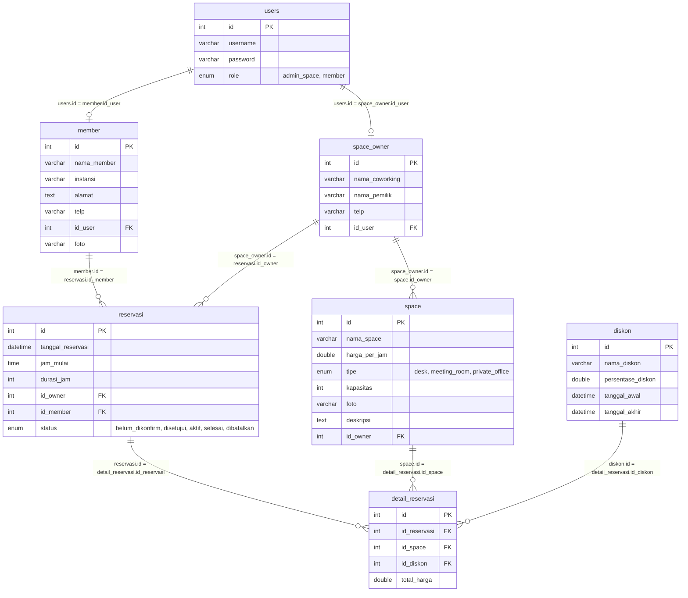

# UJI KOMPETENSI KEAHLIAN TAHUN PELAJARAN 2026/2027
## SOAL UJI KOMPETENSI

* **Satuan Pendidikan**: Sekolah Menengah Kejuruan
* **Kompetensi Keahlian**: Rekayasa Perangkat Lunak
* **Bentuk Soal**: Penugasan Perorangan (Praktik)
* **Judul Tugas**: Aplikasi Reservasi Coworking Space & Workstation (Smart Space Booking)
* **Paket Soal**: Paket B

---

## PETUNJUK UMUM

1. Periksalah dengan teliti dokumen soal ujian praktik.
2. Periksalah peralatan dan bahan yang dibutuhkan.
3. Gunakan peralatan utama dan peralatan keselamatan kerja yang telah disediakan.
4. Gunakan peralatan sesuai dengan SOP (*Standard Operating Procedure*).
5. Bekerjalah dengan memperhatikan petunjuk Pembimbing/Penguji.
6. Tetap tenang dan tidak gaduh saat berada di dalam tempat uji kompetensi.

### CARA MENGGUNAKAN DOKUMEN INI
1. Baca **Bagian I (Aspek Keterampilan)** dan **Bagian II (Gambar Kerja)** - berlaku untuk **SEMUA** kategori.
2. Tentukan kategori pengerjaan Anda: **Fullstack**, **Backend**, **Frontend (Web)**, **Mobile App**, atau **UI/UX Design**.
3. Langsung menuju **Lampiran** sesuai kategori Anda (Lampiran A-E) untuk langkah kerja, kebutuhan API, dan daftar berkas yang wajib dikumpulkan. Anda **TIDAK** perlu membaca lampiran kategori lain.

---

## DAFTAR PERALATAN

| No. | Nama Alat/Bahan/Komponen | Spesifikasi Minimal | Jumlah | Keterangan |
| :--- | :--- | :--- | :--- | :--- |
| **A. Alat** | | | | |
| 1 | Komputer berupa PC atau Laptop | Prosesor: Core i5 / yang setara<br>RAM: 8GB (minimal, 16GB direkomendasikan untuk platform mobile)<br>Keyboard, Mouse, Monitor | 1 | - |
| 2 | Mobile device / Emulator | Android 10 (Q) ke atas | 1 | Bagi yang memilih kategori Mobile App |
| 3 | Koneksi internet | Stabil, untuk mengakses API yang disediakan panitia | 1 | Bagi kategori Frontend dan Mobile App |
| **B. Software Pendukung** | | | | |
| 1 | Sistem Operasi | Windows 10 / Linux / sistem operasi lain sesuai spesifikasi komputer | 1 | - |
| 2 | Aplikasi Code Editor | Visual Studio Code / Sublime Text / Bracket, Android Studio, dll. | 1 | - |
| 3 | Aplikasi Pengolah Gambar | Adobe Photoshop / Corel Draw / Adobe Illustrator, dll. | 1 | Opsional |
| 4 | Aplikasi Web Server | Node.js / XAMPP versi terbaru | 1 | Bagi kategori Backend dan Fullstack |
| 5 | Aplikasi Desain / Wireframe | Figma / Adobe XD versi terbaru | 1 | Wajib bagi kategori UI/UX Design; opsional untuk kategori lain |
| 6 | API Client | Postman / Insomnia | 1 | Bagi kategori Backend, Frontend, dan Mobile App (untuk uji coba API) |

---

## I. SOAL ASPEK KETERAMPILAN

### Langkah Kerja Umum (berlaku untuk semua kategori)
1. Siapkan peralatan dan aplikasi pendukung yang akan digunakan sesuai kategori pilihan Anda.
2. Lakukan proses instalasi aplikasi pendukung yang dibutuhkan, jika belum diinstal.
3. Lakukan pengaturan konfigurasi aplikasi pendukung yang akan digunakan.
4. Siapkan file gambar dan file data dummy yang akan digunakan (jika diperlukan).
5. Identifikasi kebutuhan fitur berdasarkan gambaran umum aplikasi pada **Bagian II (Gambar Kerja)**.
6. Lakukan analisis entitas data yang diperlukan untuk membuat aplikasi.

*Langkah kerja selanjutnya bersifat spesifik per kategori - lihat Lampiran A-E sesuai kategori pilihan Anda.*

### Pilihan Kategori Pengerjaan (Pilih salah satu)

| Kategori | Output | Sumber Data | Keterangan |
| :--- | :--- | :--- | :--- |
| **Fullstack** | Web fullstack (server-side rendering, tanpa konsumsi API eksternal) | Basis data dibuat dan dikelola sendiri | Minimal menggunakan framework PHP (Laravel/CodeIgniter) atau native PHP |
| **Backend** | RESTful API sesuai Kontrak API (lihat Bagian III) | Basis data dibuat dan dikelola sendiri | Laravel/Node.js/Express/dll. Wajib menyertakan dokumentasi endpoint (Postman collection/Swagger) |
| **Frontend (Web)** | Aplikasi web yang mengonsumsi API | API disediakan panitia (base URL & dokumentasi diberikan saat ujian) | React/Vue/dll. Tampilan mengacu wireframe (adaptasi dari versi mobile) |
| **Mobile App** | Aplikasi mobile (APK/proyek siap jalan di emulator) yang mengonsumsi API | API disediakan panitia (base URL & dokumentasi diberikan saat ujian) | Kotlin/Flutter/dll. Tampilan mengacu wireframe mobile terlampir |
| **UI/UX Design** | Desain antarmuka (hi-fi mockup) dan prototype alur pengguna | Tidak menggunakan API – fokus pada desain | Figma/Adobe XD. Tidak ada proses coding |

---

## II. GAMBAR KERJA

Pengelola Coworking Space berencana membuat sistem penyewaan ruangan dan meja kerja (*workstation*) secara online untuk memberikan kenyamanan dan fleksibilitas bagi para freelancer, mahasiswa, startup, maupun pekerja profesional.

Sistem yang dikembangkan terdiri atas dua pengguna, yaitu **Member / Pengunjung** dan **Admin Pengelola Space**.

Aplikasi ini digunakan untuk melakukan reservasi dan pemesanan space online, pengelolaan ketersediaan ruangan/meja, penerapan promo/diskon, serta manajemen check-in / check-out. Kebutuhan minimal aplikasi adalah sebagai berikut:

### Member / Pengunjung:
1. Member dapat register akun sebagai pelanggan/pengunjung (nama lengkap, instansi, no. telepon, alamat, username, password, foto profil).
2. Member dapat login ke aplikasi pemesanan.
3. Member dapat melihat ketersediaan space (Personal Desk, Private Office, Meeting Room) lengkap dengan foto, kapasitas, fasilitas pendukung, dan harga per jam.
4. Member dapat memesan / reservasi space dengan memilih tanggal, jam mulai, durasi sewa (jam), serta memasukkan kode potongan harga / diskon promo.
5. Member dapat melihat status pemesanannya (Belum Dikonfirmasi, Disetujui, Aktif/Digunakan, Selesai, Dibatalkan).
6. Member dapat melihat histori pemesanan berdasarkan filter bulan.
7. Member dapat mencetak e-ticket / bukti nota reservasi (disertai kode reservasi dan QR Code untuk check-in di lokasi).

### Admin Pengelola Space:
1. Calon pengelola space dapat register untuk mendaftarkan lokasi coworking space, profil pengelola, dan akun admin.
2. Admin dapat login ke halaman pengelolaan space.
3. Admin dapat update data profil lokasi coworking space (nama space, nama pemilik, alamat, telepon, deskripsi fasilitas).
4. Admin dapat CRUD data member/pelanggan.
5. Admin dapat CRUD data ruangan/meja (space), tipe space (Personal Desk, Private Office, Meeting Room), kapasitas, tarif harga per jam, deskripsi, dan foto.
6. Admin dapat CRUD data kode promo/diskon event tertentu (nama diskon, persentase diskon, tanggal awal, dan tanggal akhir berlaku).
7. Admin dapat mengonfirmasi, mengubah status pesanan, serta melakukan proses check-in dan check-out tamu di lokasi.
8. Admin dapat melihat semua data reservasi dengan filter status dan filter bulan.
9. Admin dapat melihat rekapitulasi estimasi pendapatan per bulan dan distribusi pendapatan per jenis space.

---

### Desain Database (ERD - Sistem Reservasi Coworking Space)



> **Catatan**: Desain database di atas boleh disesuaikan namun tidak mengurangi fitur yang telah dijabarkan.

---

## III. KONTRAK API (APPLICATION PROGRAMMING INTERFACE)

Kontrak API berikut menjadi acuan teknis standar bagi peserta Ujian Kompetensi Keahlian (UKK) Paket B: Sistem Pemesanan Coworking Space (Smart Coworking Space Reservation System). Dokumentasi ini mencakup seluruh spesifikasi endpoint REST API backend yang disediakan oleh panitia/server penguji, termasuk mekanisme isolasi data per siswa (Multi-Tenancy App Maker), sistem autentikasi JWT Multi-Role (Member/Pelanggan & Admin Pengelola Space), katalog dan pengecekan ketersediaan space (Personal Desk, Meeting Room, Private Office), kode promo diskon, transaksi reservasi real-time, penerbitan e-ticket bukti nota digital, alur operasional check-in/check-out, serta rekapitulasi estimasi pendapatan per bulan.

### 1. Ringkasan Daftar Endpoint API

| No | Endpoint | Method | Role & Deskripsi Singkat |
| :-: | :--- | :--- | :--- |
| 1 | `/` | `GET` | Publik: Status API & Petunjuk Penggunaan |
| 2 | `/health` | `GET` | Publik: Health Check Server |
| 3 | `/api/maker/register` | `POST` | Publik: Registrasi Akun Siswa (Mendapatkan App Key Unik) |
| 4 | `/api/maker/login` | `POST` | Publik: Login Akun Siswa Pengembang Frontend |
| 5 | `/api/maker/me` | `GET` | App Maker: Lihat Profil & App Key Siswa Saat Ini |
| 6 | `/api/maker/stats` | `GET` | App Maker: Statistik Keseluruhan Data Siswa |
| 7 | `/api/maker/list` | `GET` | Guru/Penguji: Daftar Semua Siswa / App Maker Terdaftar |
| 8 | `/api/auth/register/member` | `POST` | Publik: Registrasi Akun Member / Pelanggan Baru |
| 9 | `/api/auth/register/admin-space` | `POST` | Publik: Registrasi Pengelola Lokasi / Admin Coworking Space |
| 10 | `/api/auth/login` | `POST` | Publik: Login Akun User (Member atau Admin Space) Mengembalikan JWT Token |
| 11 | `/api/auth/profile` | `GET` | Bearer User: Cek Profil & Hak Akses Pengguna yang Sedang Login |
| 12 | `/api/spaces/types` | `GET` | Publik/User: Daftar Tipe Space (Personal Desk, Meeting Room, Private Office) |
| 13 | `/api/spaces/availability` | `GET` | Publik/User: Cek Ketersediaan Space Berdasarkan Tanggal & Jam |
| 14 | `/api/spaces` | `GET` | Publik/User: Lihat Semua Space Coworking (Filter `?tipe` & `?search`) |
| 15 | `/api/spaces/{id}` | `GET` | Publik/User: Lihat Detail Space Coworking Berdasarkan ID |
| 16 | `/api/diskon/active` | `GET` | Publik/User: Daftar Promo / Diskon yang Sedang Aktif |
| 17 | `/api/diskon/check` | `POST` | Publik/User: Periksa Validitas & Hitung Potongan Kode Promo |
| 18 | `/api/diskon/{id}` | `GET` | Publik/User: Lihat Detail Diskon Berdasarkan ID |
| 19 | `/api/reservasi` | `POST` | Member: Buat Pemesanan Space Baru (+ Kode Promo & Perhitungan Otomatis) |
| 20 | `/api/reservasi/my` | `GET` | Member: Lihat Status Semua Pemesanan Milik Sendiri |
| 21 | `/api/reservasi/my/history` | `GET` | Member: Lihat Histori Pemesanan Berdasarkan Bulan & Tahun (`month`, `year`) |
| 22 | `/api/reservasi/{id}/e-ticket` | `GET` | Member/Admin: Cetak E-Ticket / Bukti Nota Digital Reservasi |
| 23 | `/api/reservasi/{id}` | `GET` | Member/Admin: Lihat Detail Reservasi Berdasarkan ID |
| 24 | `/api/reservasi/{id}/cancel` | `PATCH` | Member: Batalkan Pemesanan Space |
| 25 | `/api/admin/profile` | `GET` | Admin Space: Lihat Data Profil Lokasi Coworking Space |
| 26 | `/api/admin/profile` | `PUT` | Admin Space: Update Data Profil Lokasi Coworking Space |
| 27 | `/api/admin/members` | `GET` | Admin Space: Daftar Semua Member / Pelanggan Coworking |
| 28 | `/api/admin/members` | `POST` | Admin Space: Tambah Data Member Baru (Upload Foto) |
| 29 | `/api/admin/members/{id}` | `GET` | Admin Space: Detail Data Member Berdasarkan ID |
| 30 | `/api/admin/members/{id}` | `PUT` | Admin Space: Update Data Member / Pelanggan |
| 31 | `/api/admin/members/{id}` | `DELETE`| Admin Space: Hapus Data Member / Pelanggan |
| 32 | `/api/admin/spaces` | `GET` | Admin Space: Daftar Semua Ruangan & Meja Milik Admin |
| 33 | `/api/admin/spaces` | `POST` | Admin Space: Tambah Ruangan / Meja Space Baru Beserta Fasilitas & Foto |
| 34 | `/api/admin/spaces/{id}` | `GET` | Admin Space: Detail Data Space Berdasarkan ID |
| 35 | `/api/admin/spaces/{id}` | `PUT` | Admin Space: Update Data Ruangan & Fasilitas Space |
| 36 | `/api/admin/spaces/{id}` | `DELETE`| Admin Space: Hapus Data Ruangan / Meja Space |
| 37 | `/api/admin/diskon` | `GET` | Admin Space: Daftar Semua Kode Promo / Diskon Event |
| 38 | `/api/admin/diskon` | `POST` | Admin Space: Tambah Kode Promo / Event Diskon Baru |
| 39 | `/api/admin/diskon/{id}` | `GET` | Admin Space: Detail Data Diskon Berdasarkan ID |
| 40 | `/api/admin/diskon/{id}` | `PUT` | Admin Space: Update Data Kode Promo & Periode Diskon |
| 41 | `/api/admin/diskon/{id}` | `DELETE`| Admin Space: Hapus Kode Promo / Diskon |
| 42 | `/api/admin/reservasi` | `GET` | Admin Space: Lihat Seluruh Reservasi Coworking (`?month`, `?year`, `?status`, `?id_space`, `?tanggal`) |
| 43 | `/api/admin/reservasi/{id}/status` | `PATCH` | Admin Space: Konfirmasi & Ubah Status Pemesanan (disetujui, dibatalkan, dll) |
| 44 | `/api/admin/reservasi/{id}/check-in` | `POST` | Admin Space: Check-In Pelanggan (Status Berubah ke Aktif/Digunakan) |
| 45 | `/api/admin/reservasi/{id}/check-out` | `POST` | Admin Space: Check-Out Pelanggan (Status Berubah ke Selesai) |
| 46 | `/api/admin/reports/monthly` | `GET` | Admin Space: Rekapitulasi Estimasi & Realisasi Pendapatan Per Bulan (`?month`, `?year`) |
| 47 | `/api/admin/reports/income` | `GET` | Admin Space: Alias Rekapitulasi Pendapatan Bulanan |
| 48 | `/api/upload/image` | `POST` | User/Admin: Upload Berkas Gambar Umum (Multipart Form Data) |
| 49 | `/api/upload/spaces` | `POST` | Admin Space: Upload Foto Ruangan / Meja Space |
| 50 | `/api/upload/members` | `POST` | User/Admin: Upload Foto Profil Member / Pelanggan |

---

### KETENTUAN GLOBAL & FORMAT UMUM RESPONSE API COWORKING SPACE

1. **Mekanisme Multi-Tenancy (Header `x-maker-key` / `x-app-key`)**:
   Untuk memastikan data antar siswa tidak bercampur selama pengerjaan UKK Frontend, peserta wajib mendaftarkan akun di `POST /api/maker/register` untuk mendapatkan `app_key` (contoh: `mk_xxxxxxxxxxxx`). Header `x-maker-key: <app_key>` (atau `x-app-key`) **WAJIB** disertakan pada setiap request HTTP dari Frontend. Semua data (Member, Space, Diskon, Reservasi) akan secara otomatis terisolasi aman untuk akun Anda.
2. **Autentikasi Pengguna & Role Access (JWT Bearer Token)**:
   Endpoint yang memerlukan autentikasi login wajib menyertakan Header: `Authorization: Bearer <access_token>` yang didapatkan setelah login berhasil di `POST /api/auth/login`. Terdapat 2 Role Pengguna:
   * `'member'`: Pelanggan yang memesan space & melihat histori.
   * `'admin_space'`: Pengelola lokasi coworking yang mengelola member, space, diskon, reservasi, check-in/out, dan laporan pendapatan.
3. **Struktur Baku Standar Response JSON**:
   * **Format Sukses**:
     ```json
     {
       "status": true,
       "statusCode": 200,
       "message": "keterangan sukses",
       "data": { ... } | [ ... ],
       "timestamp": "ISO 8601"
     }
     ```
   * **Format Error**:
     ```json
     {
       "status": false,
       "statusCode": 400,
       "message": "keterangan error",
       "error": "NamaError",
       "timestamp": "ISO 8601"
     }
     ```
4. **Standar Format Tanggal, Jam & Tipe Data**:
   * Format tanggal menggunakan ISO 8601: `YYYY-MM-DD` (contoh: `2026-08-30`) atau full ISO string (`2026-08-01T00:00:00.000Z`).
   * Format jam menggunakan `HH:mm` 24-jam (contoh: `09:00`, `13:30`).
   * Durasi dinyatakan dalam satuan Jam bertipe `integer/number` (minimal 1 jam).
   * Nilai moneter / harga sewa dalam mata uang Rupiah (IDR) bertipe `integer/number`.
5. **Penyimpanan & URL Akses Foto / Media**:
   Berkas foto ruangan dan member disimpan di folder backend dan dapat diakses langsung secara publik via URL:
   * Foto Space: `http://localhost:3000/uploads/spaces/<nama_file.jpg>`
   * Foto Member: `http://localhost:3000/uploads/members/<nama_file.jpg>`
   * Media Umum: `http://localhost:3000/uploads/general/<nama_file.jpg>`

---

### 2. Spesifikasi Skema Model Data & DTO (Data Transfer Object)

#### 1. RegisterMakerDto
DTO payload pendaftaran akun siswa pengembang Frontend (App Maker)
| Nama Field | Tipe Data | Aturan | Contoh Nilai | Keterangan |
| :--- | :--- | :--- | :--- | :--- |
| `name` | string | Wajib | `Budi Santoso` | Nama lengkap siswa peserta ujian |
| `username` | string | Wajib | `budisantoso` | Username unik untuk login App Maker |
| `email` | string | Wajib | `budi@smk.sch.id` | Email unik siswa untuk login & verifikasi akun |
| `password` | string | Wajib | `Password123!` | Kata sandi akun siswa minimal 6 karakter |

#### 2. LoginMakerDto
DTO payload login siswa Frontend
| Nama Field | Tipe Data | Aturan | Contoh Nilai | Keterangan |
| :--- | :--- | :--- | :--- | :--- |
| `usernameOrEmail` | string | Wajib | `budisantoso` | Username atau alamat email siswa terdaftar |
| `password` | string | Wajib | `Password123!` | Kata sandi akun App Maker |

#### 3. RegisterMemberDto
DTO payload pendaftaran member/pelanggan baru
| Nama Field | Tipe Data | Aturan | Contoh Nilai | Keterangan |
| :--- | :--- | :--- | :--- | :--- |
| `username` | string | Wajib | `johndoe` | Username unik untuk login member |
| `password` | string | Wajib | `Secret123!` | Kata sandi akun member minimal 6 karakter |
| `nama_member` | string | Wajib | `John Doe` | Nama lengkap pelanggan / member coworking |
| `instansi` | string | Wajib | `Universitas Indonesia / PT Maju` | Nama asal instansi, kampus, atau perusahaan |
| `alamat` | string | Wajib | `Jl. Sudirman No. 123, Jakarta` | Alamat domisili lengkap pelanggan |
| `telp` | string | Wajib | `081234567890` | Nomor telepon aktif / WhatsApp member |
| `foto` | string | Opsional | `member_john.jpg` | Nama file foto profil hasil upload (opsional) |

#### 4. RegisterAdminSpaceDto
DTO payload pendaftaran pengelola/admin lokasi coworking space
| Nama Field | Tipe Data | Aturan | Contoh Nilai | Keterangan |
| :--- | :--- | :--- | :--- | :--- |
| `username` | string | Wajib | `admin_space1` | Username unik untuk login admin lokasi |
| `password` | string | Wajib | `Admin123!` | Kata sandi akun admin minimal 6 karakter |
| `nama_coworking` | string | Wajib | `Moklet Hub Coworking` | Nama lokasi / branding tempat coworking space |
| `nama_pemilik` | string | Wajib | `Ahmad Bidin` | Nama lengkap pemilik / penanggung jawab operasional |
| `telp` | string | Wajib | `081298765432` | Nomor kontak / call center pengelola lokasi |

#### 5. LoginDto
DTO payload autentikasi login (Member maupun Admin Space)
| Nama Field | Tipe Data | Aturan | Contoh Nilai | Keterangan |
| :--- | :--- | :--- | :--- | :--- |
| `username` | string | Wajib | `johndoe` | Username pengguna terdaftar |
| `password` | string | Wajib | `Secret123!` | Kata sandi akun pengguna |

#### 6. CheckPromoDto
DTO payload verifikasi dan pengecekan kode promo diskon
| Nama Field | Tipe Data | Aturan | Contoh Nilai | Keterangan |
| :--- | :--- | :--- | :--- | :--- |
| `nama_diskon` | string | Wajib | `DISKONHEMAT20` | Kode unik promo yang dimasukkan pengguna pada form checkout |

#### 7. CreateReservasiDto
DTO payload pembuatan pemesanan/reservasi space baru
| Nama Field | Tipe Data | Aturan | Contoh Nilai | Keterangan |
| :--- | :--- | :--- | :--- | :--- |
| `id_space` | number | Wajib | `1` | ID unik space/meja/ruangan yang akan dipesan |
| `tanggal_reservasi` | string | Wajib | `2026-08-30` | Tanggal rencana sewa space (format YYYY-MM-DD) |
| `jam_mulai` | string | Wajib | `09:00` | Jam mulai sewa (format HH:mm 24-jam) |
| `durasi_jam` | number | Wajib | `3` | Durasi penggunaan dalam jam (minimal 1 jam) |
| `id_diskon` | number | Opsional | `1` | ID promo diskon yang dipilih dari katalog (opsional) |
| `kode_promo` | string | Opsional | `DISKONHEMAT20` | Kode promo diskon alternatif jika diinput manual |

#### 8. UpdateCoworkingProfileDto
DTO payload pembaruan profil lokasi coworking space (Admin)
| Nama Field | Tipe Data | Aturan | Contoh Nilai | Keterangan |
| :--- | :--- | :--- | :--- | :--- |
| `nama_coworking` | string | Wajib | `Moklet Hub Coworking Space` | Nama lokasi / brand coworking space |
| `nama_pemilik` | string | Wajib | `Ahmad Bidin, S.Kom` | Nama pemilik / penanggung jawab lokasi |
| `telp` | string | Wajib | `081298765432` | Nomor telepon kontak resmi pengelola |

#### 9. CreateMemberAdminDto
DTO payload penambahan data member baru oleh Admin
| Nama Field | Tipe Data | Aturan | Contoh Nilai | Keterangan |
| :--- | :--- | :--- | :--- | :--- |
| `username` | string | Wajib | `user_budi` | Username unik login akun member |
| `password` | string | Wajib | `Secret123!` | Password awal untuk akun member |
| `nama_member` | string | Wajib | `Budi Raharjo` | Nama lengkap member baru |
| `instansi` | string | Wajib | `SMK Telkom Malang` | Nama instansi / asal organisasi member |
| `alamat` | string | Wajib | `Jl. Danau Ranau No. 1, Malang` | Alamat lengkap tempat tinggal member |
| `telp` | string | Wajib | `085712345678` | Nomor telepon aktif member |
| `foto` | string | Opsional | `budi_raharjo.jpg` | Nama file foto profil member (opsional) |

#### 10. UpdateMemberAdminDto
DTO payload perbaikan/update data member oleh Admin
| Nama Field | Tipe Data | Aturan | Contoh Nilai | Keterangan |
| :--- | :--- | :--- | :--- | :--- |
| `nama_member` | string | Opsional | `Budi Raharjo, S.T.` | Nama lengkap member yang diperbarui |
| `instansi` | string | Opsional | `PT Teknologi Hebat` | Nama instansi / organisasi baru |
| `alamat` | string | Opsional | `Jl. Danau Ranau No. 2, Malang` | Alamat domisili baru |
| `telp` | string | Opsional | `085712345678` | Nomor kontak baru |
| `password` | string | Opsional | `NewSecret123!` | Password baru jika ingin mereset kata sandi |
| `foto` | string | Opsional | `budi_new.jpg` | File foto baru jika diganti |

#### 11. CreateSpaceDto
DTO payload penambahan ruangan/meja coworking baru
| Nama Field | Tipe Data | Aturan | Contoh Nilai | Keterangan |
| :--- | :--- | :--- | :--- | :--- |
| `nama_space` | string | Wajib | `Personal Desk Alpha 01` | Nama spesifik space / ruangan / meja |
| `harga_per_jam` | number | Wajib | `25000` | Tarif sewa per jam dalam satuan Rupiah (IDR) |
| `tipe` | string | Wajib | `desk` | Kategori tipe space: `'desk'`, `'meeting_room'`, `'private_office'` |
| `kapasitas` | number | Wajib | `1` | Jumlah kapasitas maksimal orang |
| `deskripsi` | string | Wajib | `WiFi 100Mbps, stopkontak, coffee` | Rincian spesifikasi fasilitas yang tersedia |
| `foto` | string | Opsional | `desk_alpha_01.jpg` | Nama file foto ruangan hasil upload |

#### 12. UpdateSpaceDto
DTO payload pembaruan data ruangan/meja coworking
| Nama Field | Tipe Data | Aturan | Contoh Nilai | Keterangan |
| :--- | :--- | :--- | :--- | :--- |
| `nama_space` | string | Opsional | `Personal Desk Alpha 01 (Updated)` | Nama baru ruangan/meja |
| `harga_per_jam` | number | Opsional | `30000` | Tarif sewa baru per jam |
| `tipe` | string | Opsional | `desk` | Tipe space (`'desk'`, `'meeting_room'`, `'private_office'`) |
| `kapasitas` | number | Opsional | `2` | Kapasitas jumlah orang baru |
| `deskripsi` | string | Opsional | `Fasilitas upgrade monitor 27 inch 4K` | Perubahan deskripsi fasilitas |
| `foto` | string | Opsional | `desk_alpha_new.jpg` | File foto baru jika diubah |

#### 13. CreateDiskonDto
DTO payload penambahan event promo diskon baru
| Nama Field | Tipe Data | Aturan | Contoh Nilai | Keterangan |
| :--- | :--- | :--- | :--- | :--- |
| `nama_diskon` | string | Wajib | `PROMOAGUSTUS` | Kode promo unik (huruf kapital/angka tanpa spasi) |
| `persentase_diskon` | number | Wajib | `20` | Besaran potongan harga dalam persen (1 - 100) |
| `tanggal_awal` | string | Wajib | `2026-08-01T00:00:00Z` | Waktu awal berlakunya promo (ISO 8601) |
| `tanggal_akhir` | string | Wajib | `2026-08-31T23:59:59Z` | Waktu batas akhir berakhirnya promo (ISO 8601) |

#### 14. UpdateDiskonDto
DTO payload pembaruan kode promo diskon
| Nama Field | Tipe Data | Aturan | Contoh Nilai | Keterangan |
| :--- | :--- | :--- | :--- | :--- |
| `nama_diskon` | string | Opsional | `PROMOAGUSTUS2026` | Kode promo diskon yang diperbarui |
| `persentase_diskon` | number | Opsional | `25` | Persentase potongan harga baru |
| `tanggal_awal` | string | Opsional | `2026-08-01T00:00:00Z` | Waktu awal berlaku baru |
| `tanggal_akhir` | string | Opsional | `2026-09-15T23:59:59Z` | Waktu akhir berlaku baru |

#### 15. UpdateReservasiStatusDto
DTO payload perubahan status transaksi pemesanan oleh Admin
| Nama Field | Tipe Data | Aturan | Contoh Nilai | Keterangan |
| :--- | :--- | :--- | :--- | :--- |
| `status` | string | Wajib | `disetujui` | Status baru: `'belum_dikonfirm'`, `'disetujui'`, `'aktif'`, `'selesai'`, `'dibatalkan'` |

#### 16. Reservasi & Payment Entity
Struktur data lengkap objek reservasi pemesanan space
| Nama Field | Tipe Data | Aturan | Contoh Nilai | Keterangan |
| :--- | :--- | :--- | :--- | :--- |
| `id` | number | Wajib | `12` | ID unik transaksi reservasi |
| `kode_booking` | string | Wajib | `BOOK-20260830-0012` | Kode unik tiket booking pemesanan |
| `id_member` | number | Wajib | `6` | ID member pemesan |
| `id_space` | number | Wajib | `1` | ID space yang dipesan |
| `id_diskon` | number | Opsional | `1` | ID diskon yang diterapkan (null jika tanpa promo) |
| `tanggal_reservasi` | string | Wajib | `2026-08-30` | Tanggal pelaksanaan reservasi (YYYY-MM-DD) |
| `jam_mulai` | string | Wajib | `09:00` | Jam mulai pemakaian |
| `jam_selesai` | string | Wajib | `12:00` | Jam selesai pemakaian (hasil kalkulasi otomatis) |
| `durasi_jam` | number | Wajib | `3` | Total durasi waktu sewa |
| `harga_per_jam` | number | Wajib | `20000` | Tarif dasar per jam saat transaksi dilakukan |
| `total_harga_awal` | number | Wajib | `60000` | Total tarif kotor sebelum dipotong diskon |
| `potongan_diskon` | number | Wajib | `12000` | Nominal potongan harga yang didapat |
| `total_bayar` | number | Wajib | `48000` | Total bersih tagihan pembayaran yang harus dibayar |
| `status` | string | Wajib | `belum_dikonfirm` | Status sewa: `belum_dikonfirm`, `disetujui`, `aktif`, `selesai`, `dibatalkan` |

---

### Detail Request & Response per Endpoint

#### 1. Root & Health Check Service

##### `GET /` — Status API & Petunjuk Penggunaan (Root Endpoint)
* **Auth**: Tidak diperlukan (Publik)
* **Response (200)**:
  ```json
  {
    "status": true,
    "statusCode": 200,
    "message": "Berhasil memproses permintaan",
    "data": {
      "name": "Coworking Space Backend API - UKK RPL Paket B",
      "version": "1.0.0",
      "status": "online",
      "swagger_docs": "/docs",
      "description": "Backend service untuk menunjang kelas frontend dalam ujian UKK dengan multi-tenancy App Maker.",
      "documentation_links": {
        "swagger": "http://localhost:3000/docs",
        "swagger_json": "http://localhost:3000/docs-json"
      }
    },
    "timestamp": "2026-08-27T08:34:46.977Z"
  }
  ```

##### `GET /health` — Health Check Server
* **Auth**: Tidak diperlukan (Publik)
* **Response (200)**:
  ```json
  {
    "status": true,
    "statusCode": 200,
    "message": "Berhasil memproses permintaan",
    "data": {
      "status": "ok",
      "timestamp": "2026-08-27T08:34:46.981Z"
    },
    "timestamp": "2026-08-27T08:34:46.981Z"
  }
  ```

---

#### 2. Multi-Tenancy Siswa (App Maker)

##### `POST /api/maker/register` — Registrasi Akun Siswa (App Maker) & Generate App Key
* **Auth**: Tidak diperlukan (Publik)
* **Request Body**:
  ```json
  {
    "name": "Budi Santoso",
    "username": "budisantoso",
    "email": "budi@smk.sch.id",
    "password": "Password123!"
  }
  ```
* **Response (201)**:
  ```json
  {
    "status": true,
    "statusCode": 201,
    "message": "Registrasi App Maker berhasil! Simpan app_key Anda dengan baik.",
    "data": {
      "id": 5,
      "name": "Budi Santoso",
      "username": "budisantoso",
      "email": "budi@smk.sch.id",
      "app_key": "mk_4ffb8c4b40a6499ea7767bfafb32f6e0",
      "created_at": "2026-08-27T02:58:34.092Z",
      "updated_at": "2026-08-27T02:58:34.092Z",
      "access_token": "eyJhbGciOiJIUzI1NiIsInR5cCI6IkpXVCJ9..."
    },
    "timestamp": "2026-08-27T02:58:34.095Z"
  }
  ```
* **Response Error (400)**:
  ```json
  {
    "status": false,
    "statusCode": 400,
    "message": "Username atau Email sudah terdaftar sebagai App Maker!",
    "error": "Bad Request",
    "timestamp": "2026-08-27T02:58:34.096Z"
  }
  ```

##### `POST /api/maker/login` — Login Akun Siswa Pengembang Frontend
* **Auth**: Tidak diperlukan (Publik)
* **Request Body**:
  ```json
  {
    "usernameOrEmail": "budisantoso",
    "password": "Password123!"
  }
  ```
* **Response (200)**:
  ```json
  {
    "status": true,
    "statusCode": 200,
    "message": "Login App Maker berhasil!",
    "data": {
      "id": 5,
      "name": "Budi Santoso",
      "username": "budisantoso",
      "email": "budi@smk.sch.id",
      "app_key": "mk_4ffb8c4b40a6499ea7767bfafb32f6e0",
      "access_token": "eyJhbGciOiJIUzI1NiIsInR5cCI6IkpXVCJ9..."
    },
    "timestamp": "2026-08-27T08:34:54.036Z"
  }
  ```
* **Response Error (401)**:
  ```json
  {
    "status": false,
    "statusCode": 401,
    "message": "Kredensial login App Maker salah!",
    "error": "Unauthorized",
    "timestamp": "2026-08-27T08:34:54.038Z"
  }
  ```

##### `GET /api/maker/me` — Lihat Profil & App Key Siswa Saat Ini
* **Auth**: Bearer Token App Maker
* **Header**: `Authorization: Bearer <token_app_maker>`
* **Response (200)**:
  ```json
  {
    "status": true,
    "statusCode": 200,
    "message": "Berhasil memproses permintaan",
    "data": {
      "id": 5,
      "name": "Budi Santoso",
      "username": "budisantoso",
      "email": "budi@smk.sch.id",
      "app_key": "mk_4ffb8c4b40a6499ea7767bfafb32f6e0",
      "created_at": "2026-08-27T02:58:34.092Z"
    },
    "timestamp": "2026-08-27T08:35:00.120Z"
  }
  ```

##### `GET /api/maker/stats` — Statistik Keseluruhan Data Siswa (App Maker)
* **Auth**: Bearer Token App Maker / Header `x-maker-key`
* **Header**: `x-maker-key: mk_4ffb8c4b40a6499ea7767bfafb32f6e0`
* **Response (200)**:
  ```json
  {
    "status": true,
    "statusCode": 200,
    "message": "Berhasil memproses permintaan",
    "data": {
      "total_members": 5,
      "total_spaces": 4,
      "total_diskon": 3,
      "total_reservasi": 12,
      "total_pendapatan": 1450000
    },
    "timestamp": "2026-08-27T08:35:10.450Z"
  }
  ```

##### `GET /api/maker/list` — Daftar Semua Siswa / App Maker Terdaftar (Panel Guru/Penguji)
* **Auth**: Tidak diperlukan (Publik untuk pengujian panitia)
* **Response (200)**:
  ```json
  {
    "status": true,
    "statusCode": 200,
    "message": "Berhasil memproses permintaan",
    "data": [
      {
        "id": 1,
        "name": "Admin Default UKK",
        "username": "admin_default",
        "email": "admin@ukk.sch.id",
        "app_key": "mk_default_ukk_2026",
        "created_at": "2026-08-27T00:00:00.000Z"
      },
      {
        "id": 5,
        "name": "Budi Santoso",
        "username": "budisantoso",
        "email": "budi@smk.sch.id",
        "app_key": "mk_4ffb8c4b40a6499ea7767bfafb32f6e0",
        "created_at": "2026-08-27T02:58:34.092Z"
      }
    ],
    "timestamp": "2026-08-27T08:35:15.890Z"
  }
  ```

---

#### 3. Autentikasi Pengguna (Member & Admin Space)

##### `POST /api/auth/register/member` — Registrasi Akun Member / Pelanggan Baru
* **Auth**: Tidak diperlukan (Publik)
* **Header**: `x-maker-key: mk_xxxxxxxxxxxx`
* **Request Body**:
  ```json
  {
    "username": "johndoe",
    "password": "Secret123!",
    "nama_member": "John Doe",
    "instansi": "Universitas Indonesia / PT Maju Mundur",
    "alamat": "Jl. Sudirman No. 123, Jakarta Selatan",
    "telp": "081234567890",
    "foto": "member_john.jpg"
  }
  ```
* **Response (201)**:
  ```json
  {
    "status": true,
    "statusCode": 201,
    "message": "Registrasi member berhasil!",
    "data": {
      "id": 7,
      "username": "johndoe",
      "role": "member",
      "member": {
        "id": 6,
        "nama_member": "John Doe",
        "instansi": "Universitas Indonesia / PT Maju Mundur",
        "alamat": "Jl. Sudirman No. 123, Jakarta Selatan",
        "telp": "081234567890",
        "foto": "member_john.jpg"
      },
      "access_token": "eyJhbGciOiJIUzI1NiIsInR5cCI6IkpXVCJ9..."
    },
    "timestamp": "2026-08-27T02:59:53.090Z"
  }
  ```
* **Response Error (400)**:
  ```json
  {
    "status": false,
    "statusCode": 400,
    "message": "Username sudah digunakan oleh akun lain!",
    "error": "Bad Request",
    "timestamp": "2026-08-27T02:59:53.095Z"
  }
  ```

##### `POST /api/auth/register/admin-space` — Registrasi Pengelola Lokasi / Admin Coworking Space
* **Auth**: Tidak diperlukan (Publik)
* **Header**: `x-maker-key: mk_xxxxxxxxxxxx`
* **Request Body**:
  ```json
  {
    "username": "admin_space1",
    "password": "Admin123!",
    "nama_coworking": "Moklet Hub Coworking",
    "nama_pemilik": "Ahmad Bidin",
    "telp": "081298765432"
  }
  ```
* **Response (201)**:
  ```json
  {
    "status": true,
    "statusCode": 201,
    "message": "Registrasi Admin Space berhasil!",
    "data": {
      "id": 8,
      "username": "admin_space1",
      "role": "admin_space",
      "space_owner": {
        "id": 2,
        "nama_coworking": "Moklet Hub Coworking",
        "nama_pemilik": "Ahmad Bidin",
        "telp": "081298765432"
      },
      "access_token": "eyJhbGciOiJIUzI1NiIsInR5cCI6IkpXVCJ9..."
    },
    "timestamp": "2026-08-27T03:00:10.150Z"
  }
  ```

##### `POST /api/auth/login` — Login Akun Pengguna (Member atau Admin Space)
* **Auth**: Tidak diperlukan (Publik)
* **Header**: `x-maker-key: mk_xxxxxxxxxxxx`
* **Request Body**:
  ```json
  {
    "username": "johndoe",
    "password": "Secret123!"
  }
  ```
* **Response (200)**:
  ```json
  {
    "status": true,
    "statusCode": 200,
    "message": "Login berhasil!",
    "data": {
      "id": 7,
      "username": "johndoe",
      "role": "member",
      "maker_id": 5,
      "member": {
        "id": 6,
        "nama_member": "John Doe",
        "instansi": "Universitas Indonesia / PT Maju Mundur",
        "alamat": "Jl. Sudirman No. 123, Jakarta Selatan",
        "telp": "081234567890",
        "foto": "1787799592972-544446318.jpeg"
      },
      "space_owner": null,
      "access_token": "eyJhbGciOiJIUzI1NiIsInR5cCI6IkpXVCJ9..."
    },
    "timestamp": "2026-08-27T08:34:54.264Z"
  }
  ```
* **Response Error (401)**:
  ```json
  {
    "status": false,
    "statusCode": 401,
    "message": "Username atau Password salah!",
    "error": "Unauthorized",
    "timestamp": "2026-08-27T08:34:54.268Z"
  }
  ```

##### `GET /api/auth/profile` — Lihat Profil Pengguna yang Sedang Login
* **Auth**: Bearer Token (Member / Admin Space)
* **Header**:
  * `Authorization: Bearer <token_jwt>`
  * `x-maker-key: mk_xxxxxxxxxxxx`
* **Response (200)**:
  ```json
  {
    "status": true,
    "statusCode": 200,
    "message": "Berhasil memproses permintaan",
    "data": {
      "id": 7,
      "username": "johndoe",
      "role": "member",
      "member": {
        "id": 6,
        "nama_member": "John Doe",
        "instansi": "Universitas Indonesia / PT Maju Mundur",
        "alamat": "Jl. Sudirman No. 123, Jakarta Selatan",
        "telp": "081234567890",
        "foto": "1787799592972-544446318.jpeg"
      }
    },
    "timestamp": "2026-08-27T08:35:20.100Z"
  }
  ```

---

#### 4. Space Coworking (Katalog & Ketersediaan)

##### `GET /api/spaces/types` — Daftar Tipe Space (Personal Desk, Meeting Room, Private Office)
* **Auth**: Tidak diperlukan / Header `x-maker-key`
* **Header**: `x-maker-key: mk_xxxxxxxxxxxx`
* **Response (200)**:
  ```json
  {
    "status": true,
    "statusCode": 200,
    "message": "Berhasil memproses permintaan",
    "data": [
      {
        "tipe": "desk",
        "label": "Personal Desk",
        "deskripsi": "Meja kerja individual yang nyaman dengan fasilitas colokan listrik, WiFi kencang, dan air minum."
      },
      {
        "tipe": "meeting_room",
        "label": "Meeting Room",
        "deskripsi": "Ruang rapat tertutup dengan fasilitas proyektor/TV LED, whiteboard, sound system, dan AC dingin."
      },
      {
        "tipe": "private_office",
        "label": "Private Office",
        "deskripsi": "Ruang kantor privat eksklusif untuk tim kecil hingga menengah dengan akses fleksibel dan keamanan 24 jam."
      }
    ],
    "timestamp": "2026-08-27T08:34:46.984Z"
  }
  ```

##### `GET /api/spaces/availability` — Cek Ketersediaan Space Berdasarkan Tanggal & Jam
* **Auth**: Tidak diperlukan / Header `x-maker-key`
* **Header**: `x-maker-key: mk_xxxxxxxxxxxx`
* **Query / Path Parameter**: `?id_space=1&tanggal=2026-08-30&jam_mulai=09:00&durasi_jam=3`
* **Response (200)**:
  ```json
  {
    "status": true,
    "statusCode": 200,
    "message": "Space tersedia untuk dipesan pada jadwal yang diminta",
    "data": {
      "available": true,
      "id_space": 1,
      "nama_space": "Personal Desk - Flexi 01",
      "tanggal": "2026-08-30",
      "jam_mulai": "09:00",
      "jam_selesai": "12:00",
      "durasi_jam": 3,
      "harga_per_jam": 20000,
      "estimasi_total": 60000
    },
    "timestamp": "2026-08-27T08:35:30.120Z"
  }
  ```
* **Response Error (400)**:
  ```json
  {
    "status": false,
    "statusCode": 400,
    "message": "Maaf, space sudah terisi atau dibooking pada jam tersebut!",
    "error": "Bad Request",
    "timestamp": "2026-08-27T08:35:30.125Z"
  }
  ```

##### `GET /api/spaces` — Lihat Semua Space Coworking (Katalog Meja/Ruangan)
* **Auth**: Tidak diperlukan / Header `x-maker-key`
* **Header**: `x-maker-key: mk_xxxxxxxxxxxx`
* **Query Parameter**:
  * `?tipe=desk` (opsional: `desk` / `meeting_room` / `private_office`)
  * `?search=Alpha` (opsional: cari nama space/fasilitas)
* **Response (200)**:
  ```json
  {
    "status": true,
    "statusCode": 200,
    "message": "Berhasil memproses permintaan",
    "data": [
      {
        "id": 1,
        "nama_space": "Personal Desk - Flexi 01",
        "harga_per_jam": 20000,
        "tipe": "desk",
        "kapasitas": 1,
        "foto": "desk_flexi_01.jpg",
        "deskripsi": "Meja kerja individual yang tenang dan nyaman dengan colokan listrik, WiFi kencang 100Mbps, lampu meja LED, dan free refill air mineral.",
        "id_owner": 1,
        "owner": {
          "nama_coworking": "Moklet Hub Coworking Space",
          "nama_pemilik": "Ahmad Bidin, S.Kom",
          "telp": "081298765432"
        },
        "foto_url": "http://localhost:3000/uploads/spaces/desk_flexi_01.jpg"
      },
      {
        "id": 3,
        "nama_space": "Meeting Room Alpha",
        "harga_per_jam": 100000,
        "tipe": "meeting_room",
        "kapasitas": 8,
        "foto": "meeting_room_alpha.jpg",
        "deskripsi": "Ruang rapat kedap suara berkapasitas 8 orang, dilengkapi Smart TV 55 inch, soundbar Bluetooth, whiteboard kaca, AC dingin, dan conference speaker.",
        "id_owner": 1,
        "owner": {
          "nama_coworking": "Moklet Hub Coworking Space",
          "nama_pemilik": "Ahmad Bidin, S.Kom",
          "telp": "081298765432"
        },
        "foto_url": "http://localhost:3000/uploads/spaces/meeting_room_alpha.jpg"
      }
    ],
    "timestamp": "2026-08-27T08:34:47.035Z"
  }
  ```

##### `GET /api/spaces/{id}` — Lihat Detail Space Coworking Berdasarkan ID
* **Auth**: Tidak diperlukan / Header `x-maker-key`
* **Header**: `x-maker-key: mk_xxxxxxxxxxxx`
* **Path Parameter**: `id = 3` (ID unik space)
* **Response (200)**:
  ```json
  {
    "status": true,
    "statusCode": 200,
    "message": "Berhasil memproses permintaan",
    "data": {
      "id": 3,
      "nama_space": "Meeting Room Alpha",
      "harga_per_jam": 100000,
      "tipe": "meeting_room",
      "kapasitas": 8,
      "foto": "meeting_room_alpha.jpg",
      "deskripsi": "Ruang rapat kedap suara berkapasitas 8 orang, dilengkapi Smart TV 55 inch untuk presentasi, soundbar Bluetooth, whiteboard kaca, AC dingin, dan conference speaker.",
      "id_owner": 1,
      "owner": {
        "id": 1,
        "nama_coworking": "Moklet Hub Coworking Space",
        "nama_pemilik": "Ahmad Bidin, S.Kom",
        "telp": "081298765432"
      },
      "foto_url": "http://localhost:3000/uploads/spaces/meeting_room_alpha.jpg"
    },
    "timestamp": "2026-08-27T08:35:40.500Z"
  }
  ```
* **Response Error (404)**:
  ```json
  {
    "status": false,
    "statusCode": 404,
    "message": "Space dengan ID tersebut tidak ditemukan!",
    "error": "Not Found",
    "timestamp": "2026-08-27T08:35:40.505Z"
  }
  ```

---

#### 5. Diskon & Promo (Katalog Diskon)

##### `GET /api/diskon/active` — Daftar Promo / Diskon yang Sedang Aktif
* **Auth**: Tidak diperlukan / Header `x-maker-key`
* **Header**: `x-maker-key: mk_xxxxxxxxxxxx`
* **Response (200)**:
  ```json
  {
    "status": true,
    "statusCode": 200,
    "message": "Berhasil memproses permintaan",
    "data": [
      {
        "id": 1,
        "nama_diskon": "DISKONHEMAT20",
        "persentase_diskon": 20,
        "tanggal_awal": "2026-01-01T00:00:00.000Z",
        "tanggal_akhir": "2026-12-31T23:59:59.000Z"
      },
      {
        "id": 2,
        "nama_diskon": "UKKPROMO50",
        "persentase_diskon": 50,
        "tanggal_awal": "2026-08-01T00:00:00.000Z",
        "tanggal_akhir": "2026-09-30T23:59:59.000Z"
      }
    ],
    "timestamp": "2026-08-27T08:34:47.061Z"
  }
  ```

##### `POST /api/diskon/check` — Periksa Validitas & Hitung Potongan Kode Promo
* **Auth**: Tidak diperlukan / Header `x-maker-key`
* **Header**: `x-maker-key: mk_xxxxxxxxxxxx`
* **Request Body**:
  ```json
  {
    "nama_diskon": "DISKONHEMAT20"
  }
  ```
* **Response (200)**:
  ```json
  {
    "status": true,
    "statusCode": 200,
    "message": "Kode promo valid dan masih berlaku!",
    "data": {
      "id": 1,
      "nama_diskon": "DISKONHEMAT20",
      "persentase_diskon": 20,
      "tanggal_awal": "2026-01-01T00:00:00.000Z",
      "tanggal_akhir": "2026-12-31T23:59:59.000Z",
      "is_active": true
    },
    "timestamp": "2026-08-27T08:35:50.210Z"
  }
  ```
* **Response Error (400)**:
  ```json
  {
    "status": false,
    "statusCode": 400,
    "message": "Kode promo tidak ditemukan atau sudah kedaluwarsa!",
    "error": "Bad Request",
    "timestamp": "2026-08-27T08:35:50.215Z"
  }
  ```

##### `GET /api/diskon/{id}` — Lihat Detail Diskon Berdasarkan ID
* **Auth**: Tidak diperlukan / Header `x-maker-key`
* **Header**: `x-maker-key: mk_xxxxxxxxxxxx`
* **Path Parameter**: `id = 1`
* **Response (200)**:
  ```json
  {
    "status": true,
    "statusCode": 200,
    "message": "Berhasil memproses permintaan",
    "data": {
      "id": 1,
      "nama_diskon": "DISKONHEMAT20",
      "persentase_diskon": 20,
      "tanggal_awal": "2026-01-01T00:00:00.000Z",
      "tanggal_akhir": "2026-12-31T23:59:59.000Z"
    },
    "timestamp": "2026-08-27T08:35:55.700Z"
  }
  ```

---

#### 6. Reservasi Member (Pemesanan & Histori)

##### `POST /api/reservasi` — Buat Pemesanan Space Baru (Member)
* **Auth**: Bearer Token (Member)
* **Header**:
  * `Authorization: Bearer <token_member>`
  * `x-maker-key: mk_xxxxxxxxxxxx`
* **Request Body**:
  ```json
  {
    "id_space": 1,
    "tanggal_reservasi": "2026-08-30",
    "jam_mulai": "09:00",
    "durasi_jam": 3,
    "id_diskon": 1,
    "kode_promo": "DISKONHEMAT20"
  }
  ```
* **Response (201)**:
  ```json
  {
    "status": true,
    "statusCode": 201,
    "message": "Reservasi berhasil dibuat! Silakan tunggu konfirmasi admin.",
    "data": {
      "id": 12,
      "kode_booking": "BOOK-20260830-0012",
      "id_member": 6,
      "id_space": 1,
      "id_diskon": 1,
      "tanggal_reservasi": "2026-08-30",
      "jam_mulai": "09:00",
      "jam_selesai": "12:00",
      "durasi_jam": 3,
      "harga_per_jam": 20000,
      "total_harga_awal": 60000,
      "potongan_diskon": 12000,
      "total_bayar": 48000,
      "status": "belum_dikonfirm",
      "created_at": "2026-08-27T08:36:00.000Z"
    },
    "timestamp": "2026-08-27T08:36:00.050Z"
  }
  ```
* **Response Error (400)**:
  ```json
  {
    "status": false,
    "statusCode": 400,
    "message": "Space tidak tersedia pada tanggal dan rentang jam tersebut!",
    "error": "Bad Request",
    "timestamp": "2026-08-27T08:36:00.055Z"
  }
  ```

##### `GET /api/reservasi/my` — Lihat Status Semua Pemesanan Saya (Member)
* **Auth**: Bearer Token (Member)
* **Header**:
  * `Authorization: Bearer <token_member>`
  * `x-maker-key: mk_xxxxxxxxxxxx`
* **Response (200)**:
  ```json
  {
    "status": true,
    "statusCode": 200,
    "message": "Berhasil memproses permintaan",
    "data": [
      {
        "id": 12,
        "kode_booking": "BOOK-20260830-0012",
        "tanggal_reservasi": "2026-08-30",
        "jam_mulai": "09:00",
        "jam_selesai": "12:00",
        "durasi_jam": 3,
        "total_bayar": 48000,
        "status": "disetujui",
        "space": {
          "id": 1,
          "nama_space": "Personal Desk - Flexi 01",
          "tipe": "desk"
        }
      }
    ],
    "timestamp": "2026-08-27T08:36:10.120Z"
  }
  ```

##### `GET /api/reservasi/my/history` — Lihat Histori Pemesanan Berdasarkan Bulan & Tahun (Member)
* **Auth**: Bearer Token (Member)
* **Header**:
  * `Authorization: Bearer <token_member>`
  * `x-maker-key: mk_xxxxxxxxxxxx`
* **Query Parameter**:
  * `?month=8` (opsional, bulan 1-12)
  * `?year=2026` (opsional, tahun)
* **Response (200)**:
  ```json
  {
    "status": true,
    "statusCode": 200,
    "message": "Berhasil memproses permintaan",
    "data": {
      "month": 8,
      "year": 2026,
      "total_reservasi": 3,
      "total_pengeluaran": 150000,
      "items": [
        {
          "id": 12,
          "kode_booking": "BOOK-20260830-0012",
          "tanggal_reservasi": "2026-08-30",
          "jam_mulai": "09:00",
          "jam_selesai": "12:00",
          "durasi_jam": 3,
          "total_bayar": 48000,
          "status": "selesai",
          "space_name": "Personal Desk - Flexi 01"
        }
      ]
    },
    "timestamp": "2026-08-27T08:36:20.300Z"
  }
  ```

##### `GET /api/reservasi/{id}/e-ticket` — Cetak E-Ticket / Bukti Nota Digital Reservasi
* **Auth**: Bearer Token (Member / Admin Space)
* **Header**:
  * `Authorization: Bearer <token_jwt>`
  * `x-maker-key: mk_xxxxxxxxxxxx`
* **Path Parameter**: `id = 12`
* **Response (200)**:
  ```json
  {
    "status": true,
    "statusCode": 200,
    "message": "E-Ticket berhasil dimuat",
    "data": {
      "e_ticket_number": "TICKET-MOKLET-20260830-0012",
      "kode_booking": "BOOK-20260830-0012",
      "coworking_space": {
        "nama": "Moklet Hub Coworking Space",
        "telepon": "081298765432"
      },
      "member": {
        "nama": "John Doe",
        "instansi": "Universitas Indonesia / PT Maju Mundur",
        "telp": "081234567890"
      },
      "space": {
        "nama": "Personal Desk - Flexi 01",
        "tipe": "Personal Desk",
        "harga_per_jam": 20000
      },
      "jadwal": {
        "tanggal": "2026-08-30",
        "jam_mulai": "09:00",
        "jam_selesai": "12:00",
        "durasi": "3 Jam"
      },
      "rincian_pembayaran": {
        "tarif_kotor": 60000,
        "diskon_promo": "20% (DISKONHEMAT20)",
        "potongan": 12000,
        "total_dibayar": 48000
      },
      "status_reservasi": "disetujui",
      "qr_code_payload": "VERIFY-RESERVASI-12-mk_4ffb8c4b40a6499ea7767bfafb32f6e0"
    },
    "timestamp": "2026-08-27T08:36:30.450Z"
  }
  ```

##### `GET /api/reservasi/{id}` — Lihat Detail Reservasi Berdasarkan ID
* **Auth**: Bearer Token (Member / Admin Space)
* **Header**:
  * `Authorization: Bearer <token_jwt>`
  * `x-maker-key: mk_xxxxxxxxxxxx`
* **Path Parameter**: `id = 12`
* **Response (200)**:
  ```json
  {
    "status": true,
    "statusCode": 200,
    "message": "Berhasil memproses permintaan",
    "data": {
      "id": 12,
      "kode_booking": "BOOK-20260830-0012",
      "id_member": 6,
      "id_space": 1,
      "tanggal_reservasi": "2026-08-30",
      "jam_mulai": "09:00",
      "jam_selesai": "12:00",
      "durasi_jam": 3,
      "total_bayar": 48000,
      "status": "disetujui",
      "member": {
        "nama_member": "John Doe",
        "telp": "081234567890"
      },
      "space": {
        "nama_space": "Personal Desk - Flexi 01",
        "harga_per_jam": 20000
      }
    },
    "timestamp": "2026-08-27T08:36:35.100Z"
  }
  ```

##### `PATCH /api/reservasi/{id}/cancel` — Batalkan Pemesanan (Member)
* **Auth**: Bearer Token (Member)
* **Header**:
  * `Authorization: Bearer <token_member>`
  * `x-maker-key: mk_xxxxxxxxxxxx`
* **Path Parameter**: `id = 12`
* **Response (200)**:
  ```json
  {
    "status": true,
    "statusCode": 200,
    "message": "Reservasi berhasil dibatalkan oleh pengguna",
    "data": {
      "id": 12,
      "status": "dibatalkan",
      "updated_at": "2026-08-27T08:36:40.000Z"
    },
    "timestamp": "2026-08-27T08:36:40.050Z"
  }
  ```

---

#### 7. Profil Lokasi Coworking Space (Panel Admin)

##### `GET /api/admin/profile` — Lihat Data Profil Lokasi Coworking Space
* **Auth**: Bearer Token (Admin Space)
* **Header**:
  * `Authorization: Bearer <token_admin>`
  * `x-maker-key: mk_xxxxxxxxxxxx`
* **Response (200)**:
  ```json
  {
    "status": true,
    "statusCode": 200,
    "message": "Berhasil memproses permintaan",
    "data": {
      "id": 1,
      "nama_coworking": "Moklet Hub Coworking Space",
      "nama_pemilik": "Ahmad Bidin, S.Kom",
      "telp": "081298765432"
    },
    "timestamp": "2026-08-27T08:36:50.000Z"
  }
  ```

##### `PUT /api/admin/profile` — Update Data Profil Lokasi Coworking Space
* **Auth**: Bearer Token (Admin Space)
* **Header**:
  * `Authorization: Bearer <token_admin>`
  * `x-maker-key: mk_xxxxxxxxxxxx`
* **Request Body**:
  ```json
  {
    "nama_coworking": "Moklet Hub Coworking Space (Updated)",
    "nama_pemilik": "Ahmad Bidin, S.Kom",
    "telp": "081298765432"
  }
  ```
* **Response (200)**:
  ```json
  {
    "status": true,
    "statusCode": 200,
    "message": "Profil Coworking Space berhasil diperbarui!",
    "data": {
      "id": 1,
      "nama_coworking": "Moklet Hub Coworking Space (Updated)",
      "nama_pemilik": "Ahmad Bidin, S.Kom",
      "telp": "081298765432"
    },
    "timestamp": "2026-08-27T08:36:55.000Z"
  }
  ```

---

#### 8. Manajemen Member / Pelanggan (Panel Admin)

##### `GET /api/admin/members` — Daftar Semua Member / Pelanggan Coworking
* **Auth**: Bearer Token (Admin Space)
* **Header**:
  * `Authorization: Bearer <token_admin>`
  * `x-maker-key: mk_xxxxxxxxxxxx`
* **Query Parameter**: `?search=Budi` (opsional, cari nama/instansi/telp)
* **Response (200)**:
  ```json
  {
    "status": true,
    "statusCode": 200,
    "message": "Berhasil memproses permintaan",
    "data": [
      {
        "id": 1,
        "nama_member": "Budi Raharjo",
        "instansi": "SMK Telkom Malang",
        "alamat": "Jl. Danau Ranau No. 1, Sawojajar, Malang",
        "telp": "085712345678",
        "foto": "budi.jpg",
        "created_at": "2026-08-27T00:00:00.000Z"
      },
      {
        "id": 6,
        "nama_member": "John Doe",
        "instansi": "Universitas Indonesia / PT Maju Mundur",
        "alamat": "Jl. Sudirman No. 123, Jakarta Selatan",
        "telp": "081234567890",
        "foto": "1787799592972-544446318.jpeg",
        "created_at": "2026-08-27T02:59:53.089Z"
      }
    ],
    "timestamp": "2026-08-27T08:37:05.120Z"
  }
  ```

##### `POST /api/admin/members` — Tambah Data Member Baru oleh Admin
* **Auth**: Bearer Token (Admin Space)
* **Header**:
  * `Authorization: Bearer <token_admin>`
  * `x-maker-key: mk_xxxxxxxxxxxx`
* **Request Body**:
  ```json
  {
    "username": "user_budi",
    "password": "Secret123!",
    "nama_member": "Budi Raharjo",
    "instansi": "SMK Telkom Malang",
    "alamat": "Jl. Danau Ranau No. 1, Sawojajar, Malang",
    "telp": "085712345678",
    "foto": "budi.jpg"
  }
  ```
* **Response (201)**:
  ```json
  {
    "status": true,
    "statusCode": 201,
    "message": "Data member baru berhasil ditambahkan!",
    "data": {
      "id": 7,
      "nama_member": "Budi Raharjo",
      "instansi": "SMK Telkom Malang",
      "alamat": "Jl. Danau Ranau No. 1, Sawojajar, Malang",
      "telp": "085712345678",
      "foto": "budi.jpg"
    },
    "timestamp": "2026-08-27T08:37:10.000Z"
  }
  ```

##### `GET /api/admin/members/{id}` — Detail Data Member Berdasarkan ID
* **Auth**: Bearer Token (Admin Space)
* **Header**:
  * `Authorization: Bearer <token_admin>`
  * `x-maker-key: mk_xxxxxxxxxxxx`
* **Path Parameter**: `id = 6`
* **Response (200)**:
  ```json
  {
    "status": true,
    "statusCode": 200,
    "message": "Berhasil memproses permintaan",
    "data": {
      "id": 6,
      "nama_member": "John Doe",
      "instansi": "Universitas Indonesia / PT Maju Mundur",
      "alamat": "Jl. Sudirman No. 123, Jakarta Selatan",
      "telp": "081234567890",
      "foto": "1787799592972-544446318.jpeg"
    },
    "timestamp": "2026-08-27T08:37:15.000Z"
  }
  ```

##### `PUT /api/admin/members/{id}` — Update Data Member / Pelanggan (Admin)
* **Auth**: Bearer Token (Admin Space)
* **Header**:
  * `Authorization: Bearer <token_admin>`
  * `x-maker-key: mk_xxxxxxxxxxxx`
* **Path Parameter**: `id = 6`
* **Request Body**:
  ```json
  {
    "nama_member": "John Doe, S.Kom",
    "instansi": "PT Inovasi Digital",
    "alamat": "Jl. Gatot Subroto No. 45, Jakarta",
    "telp": "081234567890"
  }
  ```
* **Response (200)**:
  ```json
  {
    "status": true,
    "statusCode": 200,
    "message": "Data member berhasil diperbarui!",
    "data": {
      "id": 6,
      "nama_member": "John Doe, S.Kom",
      "instansi": "PT Inovasi Digital",
      "alamat": "Jl. Gatot Subroto No. 45, Jakarta",
      "telp": "081234567890"
    },
    "timestamp": "2026-08-27T08:37:20.000Z"
  }
  ```

##### `DELETE /api/admin/members/{id}` — Hapus Data Member / Pelanggan (Admin)
* **Auth**: Bearer Token (Admin Space)
* **Header**:
  * `Authorization: Bearer <token_admin>`
  * `x-maker-key: mk_xxxxxxxxxxxx`
* **Path Parameter**: `id = 6`
* **Response (200)**:
  ```json
  {
    "status": true,
    "statusCode": 200,
    "message": "Data member berhasil dihapus!",
    "data": {
      "id": 6,
      "deleted": true
    },
    "timestamp": "2026-08-27T08:37:25.000Z"
  }
  ```

---

#### 9. Manajemen Space Ruangan & Meja (Panel Admin)

##### `GET /api/admin/spaces` — Daftar Semua Ruangan & Meja Milik Admin
* **Auth**: Bearer Token (Admin Space)
* **Header**:
  * `Authorization: Bearer <token_admin>`
  * `x-maker-key: mk_xxxxxxxxxxxx`
* **Response (200)**:
  ```json
  {
    "status": true,
    "statusCode": 200,
    "message": "Berhasil memproses permintaan",
    "data": [
      {
        "id": 1,
        "nama_space": "Personal Desk - Flexi 01",
        "harga_per_jam": 20000,
        "tipe": "desk",
        "kapasitas": 1,
        "foto": "desk_flexi_01.jpg",
        "foto_url": "http://localhost:3000/uploads/spaces/desk_flexi_01.jpg"
      },
      {
        "id": 3,
        "nama_space": "Meeting Room Alpha",
        "harga_per_jam": 100000,
        "tipe": "meeting_room",
        "kapasitas": 8,
        "foto": "meeting_room_alpha.jpg",
        "foto_url": "http://localhost:3000/uploads/spaces/meeting_room_alpha.jpg"
      }
    ],
    "timestamp": "2026-08-27T08:37:35.000Z"
  }
  ```

##### `POST /api/admin/spaces` — Tambah Ruangan / Meja Space Baru Beserta Fasilitas & Foto
* **Auth**: Bearer Token (Admin Space)
* **Header**:
  * `Authorization: Bearer <token_admin>`
  * `x-maker-key: mk_xxxxxxxxxxxx`
* **Request Body**:
  ```json
  {
    "nama_space": "Personal Desk Alpha 01",
    "harga_per_jam": 25000,
    "tipe": "desk",
    "kapasitas": 1,
    "deskripsi": "Dilengkapi colokan listrik, WiFi 100Mbps, monitor 24 inch, dan free flow kopi/teh.",
    "foto": "desk_alpha_01.jpg"
  }
  ```
* **Response (201)**:
  ```json
  {
    "status": true,
    "statusCode": 201,
    "message": "Space baru berhasil ditambahkan!",
    "data": {
      "id": 5,
      "nama_space": "Personal Desk Alpha 01",
      "harga_per_jam": 25000,
      "tipe": "desk",
      "kapasitas": 1,
      "deskripsi": "Dilengkapi colokan listrik, WiFi 100Mbps, monitor 24 inch, dan free flow kopi/teh.",
      "foto": "desk_alpha_01.jpg",
      "id_owner": 1
    },
    "timestamp": "2026-08-27T08:37:40.000Z"
  }
  ```

##### `GET /api/admin/spaces/{id}` — Detail Data Space Berdasarkan ID
* **Auth**: Bearer Token (Admin Space)
* **Header**:
  * `Authorization: Bearer <token_admin>`
  * `x-maker-key: mk_xxxxxxxxxxxx`
* **Path Parameter**: `id = 5`
* **Response (200)**:
  ```json
  {
    "status": true,
    "statusCode": 200,
    "message": "Berhasil memproses permintaan",
    "data": {
      "id": 5,
      "nama_space": "Personal Desk Alpha 01",
      "harga_per_jam": 25000,
      "tipe": "desk",
      "kapasitas": 1,
      "deskripsi": "Dilengkapi colokan listrik, WiFi 100Mbps, monitor 24 inch, dan free flow kopi/teh.",
      "foto": "desk_alpha_01.jpg"
    },
    "timestamp": "2026-08-27T08:37:45.000Z"
  }
  ```

##### `PUT /api/admin/spaces/{id}` — Update Data Ruangan / Meja (Space)
* **Auth**: Bearer Token (Admin Space)
* **Header**:
  * `Authorization: Bearer <token_admin>`
  * `x-maker-key: mk_xxxxxxxxxxxx`
* **Path Parameter**: `id = 5`
* **Request Body**:
  ```json
  {
    "nama_space": "Personal Desk Alpha 01 (Updated)",
    "harga_per_jam": 30000,
    "kapasitas": 2,
    "deskripsi": "Fasilitas terupdate dengan monitor 27 inch 4K dan standing desk elektrik."
  }
  ```
* **Response (200)**:
  ```json
  {
    "status": true,
    "statusCode": 200,
    "message": "Data space berhasil diperbarui!",
    "data": {
      "id": 5,
      "nama_space": "Personal Desk Alpha 01 (Updated)",
      "harga_per_jam": 30000,
      "tipe": "desk",
      "kapasitas": 2,
      "deskripsi": "Fasilitas terupdate dengan monitor 27 inch 4K dan standing desk elektrik."
    },
    "timestamp": "2026-08-27T08:37:50.000Z"
  }
  ```

##### `DELETE /api/admin/spaces/{id}` — Hapus Data Ruangan / Meja (Space)
* **Auth**: Bearer Token (Admin Space)
* **Header**:
  * `Authorization: Bearer <token_admin>`
  * `x-maker-key: mk_xxxxxxxxxxxx`
* **Path Parameter**: `id = 5`
* **Response (200)**:
  ```json
  {
    "status": true,
    "statusCode": 200,
    "message": "Space berhasil dihapus!",
    "data": {
      "id": 5,
      "deleted": true
    },
    "timestamp": "2026-08-27T08:37:55.000Z"
  }
  ```

---

#### 10. Manajemen Kode Promo & Diskon (Panel Admin)

##### `GET /api/admin/diskon` — Daftar Semua Kode Promo / Diskon Event
* **Auth**: Bearer Token (Admin Space)
* **Header**:
  * `Authorization: Bearer <token_admin>`
  * `x-maker-key: mk_xxxxxxxxxxxx`
* **Response (200)**:
  ```json
  {
    "status": true,
    "statusCode": 200,
    "message": "Berhasil memproses permintaan",
    "data": [
      {
        "id": 1,
        "nama_diskon": "DISKONHEMAT20",
        "persentase_diskon": 20,
        "tanggal_awal": "2026-01-01T00:00:00.000Z",
        "tanggal_akhir": "2026-12-31T23:59:59.000Z"
      },
      {
        "id": 2,
        "nama_diskon": "UKKPROMO50",
        "persentase_diskon": 50,
        "tanggal_awal": "2026-08-01T00:00:00.000Z",
        "tanggal_akhir": "2026-09-30T23:59:59.000Z"
      }
    ],
    "timestamp": "2026-08-27T08:38:05.000Z"
  }
  ```

##### `POST /api/admin/diskon` — Tambah Kode Promo / Diskon Event Baru
* **Auth**: Bearer Token (Admin Space)
* **Header**:
  * `Authorization: Bearer <token_admin>`
  * `x-maker-key: mk_xxxxxxxxxxxx`
* **Request Body**:
  ```json
  {
    "nama_diskon": "PROMOAGUSTUS",
    "persentase_diskon": 20,
    "tanggal_awal": "2026-08-01T00:00:00Z",
    "tanggal_akhir": "2026-08-31T23:59:59Z"
  }
  ```
* **Response (201)**:
  ```json
  {
    "status": true,
    "statusCode": 201,
    "message": "Kode promo baru berhasil dibuat!",
    "data": {
      "id": 4,
      "nama_diskon": "PROMOAGUSTUS",
      "persentase_diskon": 20,
      "tanggal_awal": "2026-08-01T00:00:00.000Z",
      "tanggal_akhir": "2026-08-31T23:59:59.000Z"
    },
    "timestamp": "2026-08-27T08:38:10.000Z"
  }
  ```

##### `GET /api/admin/diskon/{id}` — Detail Data Diskon Berdasarkan ID
* **Auth**: Bearer Token (Admin Space)
* **Header**:
  * `Authorization: Bearer <token_admin>`
  * `x-maker-key: mk_xxxxxxxxxxxx`
* **Path Parameter**: `id = 4`
* **Response (200)**:
  ```json
  {
    "status": true,
    "statusCode": 200,
    "message": "Berhasil memproses permintaan",
    "data": {
      "id": 4,
      "nama_diskon": "PROMOAGUSTUS",
      "persentase_diskon": 20,
      "tanggal_awal": "2026-08-01T00:00:00.000Z",
      "tanggal_akhir": "2026-08-31T23:59:59.000Z"
    },
    "timestamp": "2026-08-27T08:38:15.000Z"
  }
  ```

##### `PUT /api/admin/diskon/{id}` — Update Data Kode Promo / Diskon
* **Auth**: Bearer Token (Admin Space)
* **Header**:
  * `Authorization: Bearer <token_admin>`
  * `x-maker-key: mk_xxxxxxxxxxxx`
* **Path Parameter**: `id = 4`
* **Request Body**:
  ```json
  {
    "nama_diskon": "PROMOAGUSTUS2026",
    "persentase_diskon": 25,
    "tanggal_akhir": "2026-09-15T23:59:59Z"
  }
  ```
* **Response (200)**:
  ```json
  {
    "status": true,
    "statusCode": 200,
    "message": "Data promo diskon berhasil diperbarui!",
    "data": {
      "id": 4,
      "nama_diskon": "PROMOAGUSTUS2026",
      "persentase_diskon": 25,
      "tanggal_akhir": "2026-09-15T23:59:59.000Z"
    },
    "timestamp": "2026-08-27T08:38:20.000Z"
  }
  ```

##### `DELETE /api/admin/diskon/{id}` — Hapus Kode Promo / Diskon
* **Auth**: Bearer Token (Admin Space)
* **Header**:
  * `Authorization: Bearer <token_admin>`
  * `x-maker-key: mk_xxxxxxxxxxxx`
* **Path Parameter**: `id = 4`
* **Response (200)**:
  ```json
  {
    "status": true,
    "statusCode": 200,
    "message": "Kode promo berhasil dihapus!",
    "data": {
      "id": 4,
      "deleted": true
    },
    "timestamp": "2026-08-27T08:38:25.000Z"
  }
  ```

---

#### 11. Transaksi Reservasi & Check-In/Check-Out (Panel Admin)

##### `GET /api/admin/reservasi` — Lihat Seluruh Data Reservasi Coworking Space (Filter Lengkap)
* **Auth**: Bearer Token (Admin Space)
* **Header**:
  * `Authorization: Bearer <token_admin>`
  * `x-maker-key: mk_xxxxxxxxxxxx`
* **Query Parameter**:
  * `?month=8` (opsional, filter bulan 1-12)
  * `?year=2026` (opsional, filter tahun)
  * `?status=belum_dikonfirm` (opsional: `belum_dikonfirm` / `disetujui` / `aktif` / `selesai` / `dibatalkan`)
  * `?id_space=1` (opsional, filter berdasarkan ID Space)
  * `?tanggal=2026-08-30` (opsional, filter tanggal spesifik)
* **Response (200)**:
  ```json
  {
    "status": true,
    "statusCode": 200,
    "message": "Berhasil memproses permintaan",
    "data": [
      {
        "id": 12,
        "kode_booking": "BOOK-20260830-0012",
        "tanggal_reservasi": "2026-08-30",
        "jam_mulai": "09:00",
        "jam_selesai": "12:00",
        "durasi_jam": 3,
        "total_harga_awal": 60000,
        "potongan_diskon": 12000,
        "total_bayar": 48000,
        "status": "belum_dikonfirm",
        "member": {
          "id": 6,
          "nama_member": "John Doe",
          "telp": "081234567890"
        },
        "space": {
          "id": 1,
          "nama_space": "Personal Desk - Flexi 01",
          "tipe": "desk"
        }
      }
    ],
    "timestamp": "2026-08-27T08:38:35.000Z"
  }
  ```

##### `PATCH /api/admin/reservasi/{id}/status` — Konfirmasi & Ubah Status Pemesanan (Admin)
* **Auth**: Bearer Token (Admin Space)
* **Header**:
  * `Authorization: Bearer <token_admin>`
  * `x-maker-key: mk_xxxxxxxxxxxx`
* **Path Parameter**: `id = 12`
* **Request Body**:
  ```json
  {
    "status": "disetujui"
  }
  ```
* **Response (200)**:
  ```json
  {
    "status": true,
    "statusCode": 200,
    "message": "Status reservasi berhasil diperbarui menjadi disetujui",
    "data": {
      "id": 12,
      "status": "disetujui",
      "updated_at": "2026-08-27T08:38:40.000Z"
    },
    "timestamp": "2026-08-27T08:38:40.050Z"
  }
  ```

##### `POST /api/admin/reservasi/{id}/check-in` — Check-In Pelanggan (Ubah Status ke Aktif / Digunakan)
* **Auth**: Bearer Token (Admin Space)
* **Header**:
  * `Authorization: Bearer <token_admin>`
  * `x-maker-key: mk_xxxxxxxxxxxx`
* **Path Parameter**: `id = 12`
* **Response (200)**:
  ```json
  {
    "status": true,
    "statusCode": 200,
    "message": "Check-in member berhasil! Status reservasi aktif.",
    "data": {
      "id": 12,
      "status": "aktif",
      "check_in_time": "2026-08-30T09:02:15.000Z"
    },
    "timestamp": "2026-08-27T08:38:45.000Z"
  }
  ```

##### `POST /api/admin/reservasi/{id}/check-out` — Check-Out Pelanggan (Ubah Status ke Selesai)
* **Auth**: Bearer Token (Admin Space)
* **Header**:
  * `Authorization: Bearer <token_admin>`
  * `x-maker-key: mk_xxxxxxxxxxxx`
* **Path Parameter**: `id = 12`
* **Response (200)**:
  ```json
  {
    "status": true,
    "statusCode": 200,
    "message": "Check-out member berhasil! Reservasi telah selesai.",
    "data": {
      "id": 12,
      "status": "selesai",
      "check_out_time": "2026-08-30T12:00:00.000Z"
    },
    "timestamp": "2026-08-27T08:38:50.000Z"
  }
  ```

---

#### 12. Rekapitulasi Laporan Pendapatan Bulanan (Panel Admin)

##### `GET /api/admin/reports/monthly` — Rekapitulasi Estimasi & Realisasi Pendapatan Per Bulan (Laporan)
* **Auth**: Bearer Token (Admin Space)
* **Header**:
  * `Authorization: Bearer <token_admin>`
  * `x-maker-key: mk_xxxxxxxxxxxx`
* **Query Parameter**:
  * `?month=8` (opsional, bulan 1-12)
  * `?year=2026` (opsional, filter tahun)
* **Response (200)**:
  ```json
  {
    "status": true,
    "statusCode": 200,
    "message": "Berhasil memproses permintaan",
    "data": {
      "month": 8,
      "year": 2026,
      "total_transaksi": 15,
      "total_jam_terpakai": 48,
      "estimasi_pendapatan_kotor": 1850000,
      "total_potongan_diskon": 250000,
      "realisasi_pendapatan_bersih": 1600000,
      "rincian_per_tipe_space": [
        {
          "tipe": "desk",
          "label": "Personal Desk",
          "total_booking": 10,
          "total_jam": 30,
          "total_pendapatan": 600000
        },
        {
          "tipe": "meeting_room",
          "label": "Meeting Room",
          "total_booking": 3,
          "total_jam": 8,
          "total_pendapatan": 750000
        },
        {
          "tipe": "private_office",
          "label": "Private Office",
          "total_booking": 2,
          "total_jam": 10,
          "total_pendapatan": 250000
        }
      ]
    },
    "timestamp": "2026-08-27T08:39:00.000Z"
  }
  ```

##### `GET /api/admin/reports/income` — Alias Endpoint untuk Rekapitulasi Pendapatan Bulanan
* **Auth**: Bearer Token (Admin Space)
* **Header**:
  * `Authorization: Bearer <token_admin>`
  * `x-maker-key: mk_xxxxxxxxxxxx`
* **Query Parameter**: `?month=8&year=2026`
* **Response (200)**:
  ```json
  {
    "status": true,
    "statusCode": 200,
    "message": "Berhasil memproses permintaan",
    "data": {
      "month": 8,
      "year": 2026,
      "realisasi_pendapatan_bersih": 1600000
    },
    "timestamp": "2026-08-27T08:39:05.000Z"
  }
  ```

---

#### 13. Upload Berkas & Gambar (Media)

##### `POST /api/upload/image` — Upload Berkas Gambar Umum (Multipart Form Data)
* **Auth**: Tidak diperlukan / Header `x-maker-key`
* **Header**:
  * `Content-Type: multipart/form-data`
  * `x-maker-key: mk_xxxxxxxxxxxx`
* **Request Body (Form-Data)**: `file: [File Binary / Buffer Gambar (.jpg, .jpeg, .png, .webp)]`
* **Response (201)**:
  ```json
  {
    "status": true,
    "statusCode": 201,
    "message": "File berhasil diupload",
    "data": {
      "filename": "1787799592972-544446318.jpeg",
      "original_name": "banner.jpg",
      "mimetype": "image/jpeg",
      "size": 1048576,
      "url": "http://localhost:3000/uploads/general/1787799592972-544446318.jpeg"
    },
    "timestamp": "2026-08-27T08:39:15.000Z"
  }
  ```

##### `POST /api/upload/spaces` — Upload Foto Ruangan / Space Coworking
* **Auth**: Tidak diperlukan / Header `x-maker-key`
* **Header**:
  * `Content-Type: multipart/form-data`
  * `x-maker-key: mk_xxxxxxxxxxxx`
* **Request Body (Form-Data)**: `file: [File Foto Ruangan / Meja Space (.jpg, .jpeg, .png)]`
* **Response (201)**:
  ```json
  {
    "status": true,
    "statusCode": 201,
    "message": "Foto space berhasil diupload",
    "data": {
      "filename": "meeting_room_alpha.jpg",
      "url": "http://localhost:3000/uploads/spaces/meeting_room_alpha.jpg"
    },
    "timestamp": "2026-08-27T08:39:20.000Z"
  }
  ```

##### `POST /api/upload/members` — Upload Foto Profil Member / Pelanggan
* **Auth**: Tidak diperlukan / Header `x-maker-key`
* **Header**:
  * `Content-Type: multipart/form-data`
  * `x-maker-key: mk_xxxxxxxxxxxx`
* **Request Body (Form-Data)**: `file: [File Foto Member (.jpg, .jpeg, .png)]`
* **Response (201)**:
  ```json
  {
    "status": true,
    "statusCode": 201,
    "message": "Foto member berhasil diupload",
    "data": {
      "filename": "1787799592972-544446318.jpeg",
      "url": "http://localhost:3000/uploads/members/1787799592972-544446318.jpeg"
    },
    "timestamp": "2026-08-27T08:39:25.000Z"
  }
  ```

---

## LAMPIRAN
### Lembar Kerja per Kategori

---

### LAMPIRAN A: KATEGORI FULLSTACK

| Parameter | Keterangan |
| :--- | :--- |
| **Output** | Web fullstack (server-side rendering, tanpa konsumsi API eksternal) |
| **Tools Utama** | PHP (Laravel), native PHP, node express, atau framework lain |
| **Sumber Data** | Basis data dibuat dan dikelola sendiri |
| **Akses API Panitia?** | Tidak perlu |

#### Langkah Kerja
1. Siapkan environment (PHP/NodeJS, database server, code editor).
2. Buat basis data sesuai ERD pada Bagian II (boleh disesuaikan tanpa mengurangi fitur).
3. Implementasikan seluruh fitur Member (register, login, lihat ketersediaan space, pesan space dengan jam & diskon, lihat status pesanan, lihat histori per bulan, cetak e-ticket/nota reservasi).
4. Implementasikan seluruh fitur Admin (register pengelola, login, update profil coworking space, CRUD member, CRUD space & fasilitas, CRUD diskon promo, konfirmasi pesanan & check-in/check-out, lihat semua reservasi per bulan, rekapitulasi estimasi pendapatan).
5. Terapkan validasi input dan hashing password.
6. Uji seluruh alur aplikasi secara end-to-end sebelum dikumpulkan.

#### Berkas yang Wajib Dikumpulkan
1. Source code lengkap (folder project).
2. File basis data (SQL export) atau script migrasi.
3. Dokumen singkat: framework yang digunakan dan cara menjalankan aplikasi.

---

### LAMPIRAN B: KATEGORI BACKEND

| Parameter | Keterangan |
| :--- | :--- |
| **Output** | RESTful API sesuai Kontrak API (Bagian III) |
| **Tools Utama** | Node.js/Express, Laravel, atau NestJS |
| **Sumber Data** | Basis data dibuat dan dikelola sendiri |
| **Akses API Panitia?** | Tidak perlu (Anda yang menyediakan API) |

#### Langkah Kerja
1. Siapkan environment (Node.js/Laravel/Express, database server).
2. Buat basis data sesuai ERD pada Bagian II (boleh disesuaikan tanpa mengurangi fitur).
3. Implementasikan seluruh endpoint pada Kontrak API (Bagian III).
4. Terapkan autentikasi dan hashing password.
5. Uji setiap endpoint menggunakan Postman/Insomnia sebelum dianggap selesai.
6. Ekspor dokumentasi API (Postman collection atau Swagger export).
7. Lihat daftar endpoint lengkap pada Bagian III – Kontrak API.

#### Berkas yang Wajib Dikumpulkan
1. Source code lengkap (folder project).
2. File basis data (SQL export) atau script migrasi.
3. Dokumentasi API (Postman collection/Swagger export).
4. Dokumen singkat cara menjalankan aplikasi (base URL, port, dsb.).

---

### LAMPIRAN C: KATEGORI FRONTEND (WEB)

| Parameter | Keterangan |
| :--- | :--- |
| **Output** | Aplikasi web yang mengonsumsi API |
| **Tools Utama** | NextJS/ReactJS/VueJS atau framework pilihan Anda |
| **Sumber Data** | API disediakan panitia |
| **Akses API Panitia?** | Ya – base URL & dokumentasi diberikan panitia saat ujian dimulai |

#### Langkah Kerja
1. Siapkan environment (Node.js, Next/React/Vue/framework pilihan Anda).
2. Minta base URL API dan dokumentasi endpoint kepada panitia.
3. Bangun halaman sesuai fitur Member & Admin pada Bagian II (Gambar Kerja).
4. Sesuaikan tata letak wireframe mobile terlampir untuk versi web.
5. Hubungkan seluruh form/aksi ke endpoint API yang sesuai.
6. Uji tampilan responsif, minimal untuk ukuran layar laptop/tablet.
7. Lihat daftar endpoint lengkap pada Bagian III – Kontrak API.

#### Berkas yang Wajib Dikumpulkan
1. Source code lengkap (folder project).
2. Dokumen singkat: framework yang digunakan dan cara menjalankan aplikasi.

---

### LAMPIRAN D: KATEGORI MOBILE APP

| Parameter | Keterangan |
| :--- | :--- |
| **Output** | Aplikasi mobile (APK/proyek siap jalan di emulator) yang mengonsumsi API |
| **Tools Utama** | Kotlin/Flutter dengan Android Studio |
| **Sumber Data** | API disediakan panitia |
| **Akses API Panitia?** | Ya – base URL & dokumentasi diberikan panitia saat ujian dimulai |

#### Langkah Kerja
1. Siapkan environment (Android Studio/Flutter SDK, emulator/device Android 10 ke atas).
2. Minta base URL API dan dokumentasi endpoint kepada panitia.
3. Bangun layar sesuai wireframe mobile pada Bagian II (Gambar Kerja).
4. Hubungkan seluruh layar ke endpoint API yang sesuai.
5. Uji aplikasi pada emulator/device sebelum dikumpulkan.
6. Siapkan APK debug atau proyek yang siap dijalankan langsung untuk penilaian.
7. Lihat daftar endpoint lengkap pada Bagian III – Kontrak API.

#### Berkas yang Wajib Dikumpulkan
1. Source code lengkap (folder project).
2. File APK debug (jika tersedia).
3. Dokumen singkat: framework yang digunakan dan cara menjalankan aplikasi.

#### Wireframe untuk Mobile

##### A. Member / Pengunjung (7 Layar):
1. **Register Akun**: Nama Lengkap, Instansi, No Telepon, Alamat, Username, Password, Foto Profil.
2. **Login**: Username / Password.
3. **Ketersediaan Space**: Search bar, filter tipe (Personal Desk, Private Office, Meeting Room) dengan thumbnail foto, kapasitas, dan harga per jam.
4. **Pesan Space**: Pemilihan tanggal, jam mulai, durasi (jam), input kode voucher / diskon promo, rincian biaya, tombol Lanjutkan.
5. **Status Pemesanan**: Daftar kartu reservasi (kode booking, tanggal, durasi, total bayar, status: *Belum Dikonfirmasi / Disetujui / Aktif / Selesai / Dibatalkan*).
6. **Histori Pemesanan**: Filter bulan/tahun, total reservasi, total pengeluaran, daftar riwayat sewa.
7. **E-Ticket / Bukti Reservasi**: Nomor tiket, QR Code untuk verifikasi/check-in, data coworking space, data member, space & jadwal, rincian pembayaran, tombol Bagikan / Unduh.

##### B. Admin Pengelola Space (9 Layar):
1. **Register Admin/Pengelola**: Nama Lokasi Coworking, Nama Pemilik, No Telepon, Username, Password.
2. **Login Admin**: Username / Password admin pengelola.
3. **Profil Lokasi**: Form edit Nama Coworking Space, Nama Pemilik, No Telepon Kontak, Fasilitas & Deskripsi.
4. **Data Member (CRUD)**: Pencarian member, list kartu member (nama, instansi, telepon), tombol tambah/edit/hapus member.
5. **Data Diskon / Promo (CRUD)**: Daftar promo aktif (persentase, periode masa berlaku), tombol tambah/edit/hapus voucher promo.
6. **Kelola Reservasi**: Detail reservasi per tamu, rincian space & durasi, tombol aksi (*Check-in / Check-out / Konfirmasi Status*).
7. **Semua Reservasi (Filter Bulan)**: Filter status, filter bulan/tahun, pencarian tanggal/space.
8. **Rekapitulasi Pendapatan**: Total pendapatan kotor, total potongan promo, total pendapatan bersih, grafik statistik tren bulanan, rincian distribusi pendapatan per jenis space (Personal Desk, Meeting Room, Private Office).

---

### LAMPIRAN E: KATEGORI UI/UX DESIGN

| Parameter | Keterangan |
| :--- | :--- |
| **Output** | Desain antarmuka (hi-fi mockup) dan prototype alur pengguna |
| **Tools Utama** | Figma atau Adobe XD |
| **Sumber Data** | Tidak menggunakan API – fokus pada desain |
| **Akses API Panitia?** | Tidak perlu |

#### Langkah Kerja
1. Pelajari seluruh kebutuhan fitur Member & Admin pada Bagian II (Gambar Kerja).
2. Susun design system dasar (palet warna, tipografi, komponen button/card/form field).
3. Buat hi-fi mockup seluruh layar Member (7 layar) dan Admin (9 layar) sesuai wireframe terlampir.
4. Susun prototype interaktif untuk minimal 2 alur utama: proses reservasi space kerja dan proses check-in / check-out tamu.
5. Ekspor seluruh layar ke format PDF/PNG.
6. Siapkan tautan share Figma/Adobe XD (mode view/comment).

#### Berkas yang Wajib Dikumpulkan
1. Tautan share Figma/XD (mode view/comment).
2. File ekspor PDF/PNG seluruh layar.
3. Dokumen design system (warna, tipografi, komponen).

---

**SELAMAT MENGERJAKAN & SUKSES**
